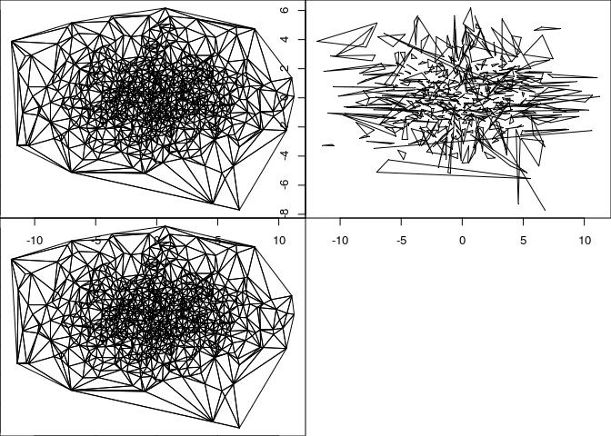
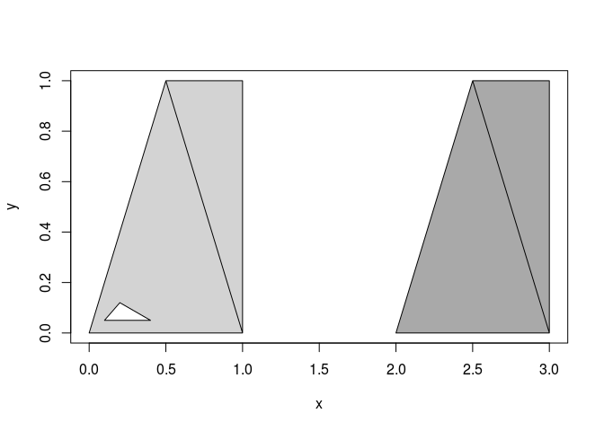
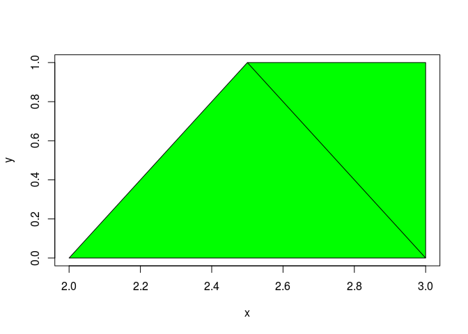

<!-- README.md is generated from README.Rmd. Please edit that file -->
The **gris** package provides a relational geometry/topology model for spatial data in R. This is inspired by data models used in the commercial products Manifold GIS and Eonfusion. The main aspirations are

-   remove the X/Y limitation on vertex attributes for points, lines, surfaces (and polygons)
-   allow multiple topology types in individual layers
-   provide a flexible basis for conversion between other formats.
-   provide a raster model that avoids conflating grid dimension with cell attributes (not yet illustrated)

### Build objects from other packages

Here we load a commonly used layer of country polygons and convert to the gris format of tables with vertices/branches/objects.

``` r
library(gris)
library(maptools)
data(wrld_simpl)
dat <- bld(wrld_simpl)
dat1 <- sbs(dat, filter(dat$o, NAME %in% c("Australia", "Indonesia", "Papua New Guinea")))
pl(dat1$v, asp = 1.3)
```



The function `bld` builds a **gris** object from a SpatialPolygonsDataFrame, `sbs` provides simple subsetting based on **dplyr**, and `pl` plots the individual branches of each object using polypath with a unique colour for objects.

### Triangulation

Triangulate with CGAL via [cgalgris](https://github.com/mdsumner/cgalgris). The function `tri_xy` performs an exact Delaunay triangulation on all vertices, returning a triplet-index for each triangle (zero-based in CGAL). Then process all triangles to detect which fall within the input polygons and plot them separately. (This test is inexact, since some polygon boundaries will not conform to the overall triangulation but CGAL does provide this ability).

``` r
library(cgalgris)
## Delaunay triangulation (unconstrained)
dat1$vi <- tri_xy(dat1$v$x, dat1$v$y) + 1  ## plus 1 for R indexing

## centroids of triangles
centr <- data_frame(x = dat1$v$x[dat1$vi], y = dat1$v$y[dat1$vi], t = rep(seq(length(dat1$vi)/3), each = 3)) %>% group_by(t) %>% summarize(x = mean(x), y = mean(y)) %>% select(x, y, t)
 
x1 <- dat1$v %>% mutate(mg = .br0) %>%  group_by(mg) %>% do(rbind(., NA_real_))
inside <- which(point.in.polygon(centr$x, centr$y, x1$x, x1$y) == 1)
## plot all triangles
plot(dat1$v$x, dat1$v$y, type = "n", asp = 1.3)
apply(matrix(dat1$vi, ncol = 3, byrow = TRUE), 1, function(x) polypath(cbind(dat1$v$x[x], dat1$v$y[x]), col = "#FF000080"))
#> NULL
## overplot only those that are internal to the polygons (not exact since triangulation is unconstrained)
apply(matrix(dat1$vi, ncol = 3, byrow = TRUE)[inside, ], 1, function(x) polypath(cbind(dat1$v$x[x], dat1$v$y[x]), col = "#0066FF99", border = "grey"))
#> NULL
points(centr[, c("x", "y")], cex = 0.2) 
```


Future versions will leverage more of CGAL for this functionality.

### Current limitations and issues

-   all implementation is raw objects, with lists of dplyr tables to keep things simple for now
-   no normalization of vertices, this would require separate tables for linkages between vertices\<-\>branches and branches\<-\>objects
-   no distinction between polygons and lines, apart from the `type` argument to `pl` for interpretation of branches when plotting
-   no features for multi-point geometries, though this is pretty straightforward
-   dplyr is susceptible to left-over attributes on vectors: <https://github.com/hadley/dplyr/issues/859>
-   the relational model is incomplete, with branch and object ids both present on the vertices table for now

### Build up the objects from scratch.

These examples show the inner workings of **gris**.

``` r
library(gris)

## one object, two branches
v1 <- data_frame(x = c(0, 1, 0.5), y = c(0, 0, 1), .br0 = 1, .ob0 = 1)
v2 <- data_frame(x = c(1, 1, 0.5), y = c(0, 1, 1), .br0 = 2, .ob0 = 1)

## another object two branches
v3 <- v1 %>% mutate(x = x + 2, .br0 = 4, .ob0 = 2)
v4 <- v2 %>% mutate(x = x + 2, .br0 = 5, .ob0 = 2)
## third branch in first  object
v0 <- data_frame(x = c(0.1, 0.4, 0.2), y = c(0.05, 0.05, 0.12), .br0 = 3, .ob0 = 1)
v <- bind_rows(v1,  v2, v0,  v3, v4) %>% mutate(id = seq(n()))

## plot with two colours
pl(v, col = c("lightgrey", "darkgrey"))
```



``` r

## build a composite with data attributes on the individual objects
b <- v %>% distinct(.br0) %>% select(.br0, .ob0)
o <- b %>% distinct(.ob0) %>% mutate(id = .ob0) %>% select(id)
o$Name <- c("p", "q")
##v <- v %>% select(-.ob0)

x <- list(v = v, b = b, o = o)

## subset by name
dq <- sbs(x, filter(x$o, Name == "q"))
pl(dq$v, col = "green")
```


