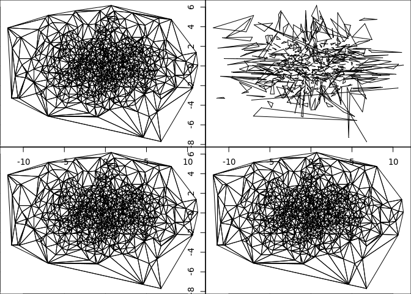
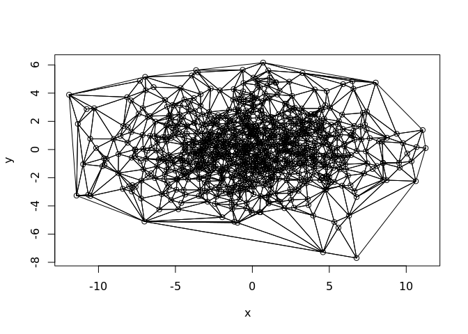
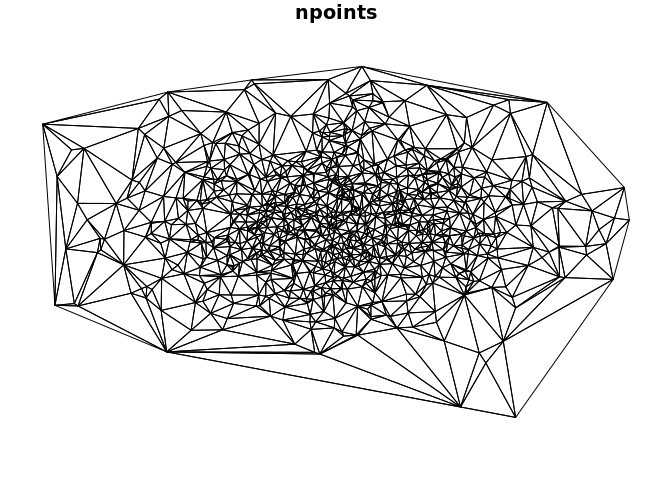

[](https://travis-ci.org/hypertidy/laridae) [](https://ci.appveyor.com/project/hypertidy/laridae)

<!-- README.md is generated from README.Rmd. Please edit that file -->
`laridae` came out of a need for constrained triangulation for a topology-in-R project. That effort has moved on somewhat, proving the case by using `RTriangle` and then bedding down the normalization model in the `mdsumner/sc` package.

Today (August 2017) this is just to explore the CGAL API from R, particularly for feeding it vertex pools and constraints from `sc`-like decompositions. It's not clear how path/edge models are best translated, but maybe we can figure that out here.

The interest in constrained triangulations is discussed here along with the overall landscape in R.

<https://github.com/r-spatial/discuss/issues/6>

Installation
------------

Dev-only for now

### Linux

Ubuntu/Debian

``` bash
apt install libcgal-dev
apt install libcgal-demo
apt install cmake g++
```

Other OS ...
------------

And then
--------

Make sure to run this when your defs change, also when the system has been updated ?

``` r
tools::package_native_routine_registration_skeleton("../laridae", "src/init.c",character_only = FALSE)
```

WIP

Triangulation
-------------

Triangulate with CGAL via [laridae](https://github.com/hypertidy/laridae). The function `tri_xy` performs an exact Delaunay triangulation on all vertices, returning a triplet-index for each triangle (zero-based in CGAL).

Some timings, to show we aren't wildly off-base and that CGAL wins for raw unconstrained Delaunay triangulation.

``` r
#x    <- c(2.3,3.0,7.0,1.0,3.0,8.0)
#y    <- c(2.3,3.0,2.0,5.0,8.0,9.0)

set.seed(90)
x <- rnorm(1e3, sd = 4)
y <- rnorm(1e3, sd = 2)
#x <- c(0, 0, 1, 1)
#y <- c(0, 1, 1, 0)
library(laridae)

# plot a matrix xy as points
# and add the triangulation indexed
# by structural triplet row-identifiers
poly_index <- function(xy, index, ...) {
  plot(xy, ...)
  ## assume index is 0,1,2,0,1,2,0,1,...
  ii <- c(rbind(matrix(index, nrow = 3), NA_integer_))
  ## have forgetten why polypath fails, so just use polygon
  polygon(xy[ii, 1], xy[ii, 2])
}


library(dplyr)
#> 
#> Attaching package: 'dplyr'
#> The following objects are masked from 'package:stats':
#> 
#>     filter, lag
#> The following objects are masked from 'package:base':
#> 
#>     intersect, setdiff, setequal, union
library(tibble)
#xy <- cbind(x, y)  %>% as_tibble() %>% arrange(x, desc(y)) %>% as.matrix()
xy <- cbind(x, y)
system.time({
  ind_t <- tri_xy(xy[,1], xy[,2]) + 1
})
#>    user  system elapsed 
#>   0.002   0.000   0.002
system.time({
  ind_t1 <- tri_xy1(xy[,1], xy[,2]) + 1
})
#>    user  system elapsed 
#>   0.001   0.000   0.002
system.time({
  ind_t2 <- tri_xy2(xy[,1], xy[,2]) + 1
})
#>    user  system elapsed 
#>   0.002   0.000   0.002

length(ind_t)
#> [1] 5961
length(ind_t1)
#> [1] 5961
length(ind_t2)
#> [1] 5961


ps <- RTriangle::pslg(P = xy)
system.time({
  ind_T <- c(t(RTriangle::triangulate(ps)$T))
})
#>    user  system elapsed 
#>   0.002   0.000   0.003
length(ind_T)
#> [1] 5961

p <- par(mfrow = c(2, 2), mar = rep(0, 4))
poly_index(xy, ind_t, pch = ".")
## can't work as order is not aligned, but still fun
poly_index(xy, ind_t1, pch = ".")  
poly_index(xy, ind_t2, pch = ".")
poly_index(xy, ind_T, pch = ".")
```



``` r
par(p)


## other comparisons
library(deldir)
#> deldir 0.1-14
system.time(dl <- deldir::deldir(x, y))
#> 
#>      PLEASE NOTE:  The components "delsgs" and "summary" of the
#>  object returned by deldir() are now DATA FRAMES rather than
#>  matrices (as they were prior to release 0.0-18).
#>  See help("deldir").
#>  
#>      PLEASE NOTE: The process that deldir() uses for determining
#>  duplicated points has changed from that used in version
#>  0.0-9 of this package (and previously). See help("deldir").
#>    user  system elapsed 
#>   0.050   0.004   0.054
plot(dl)
```


``` r
library(geometry)
#> Loading required package: magic
#> Loading required package: abind
system.time(gm <- geometry::delaunayn(xy))
#> 
#>      PLEASE NOTE:  As of version 0.3-5, no degenerate (zero area) 
#>      regions are returned with the "Qt" option since the R 
#>      code removes them from the triangulation. 
#>      See help("delaunayn").
#>    user  system elapsed 
#>   0.009   0.000   0.009
poly_index(xy, c(t(gm)))

## sf comparison
library(dplyr)
library(sf)
#> Linking to GEOS 3.6.2, GDAL 2.2.3, proj.4 4.9.3
```



``` r
d <- st_as_sf(tibble::as_tibble(xy) %>% mutate(a = row_number()), coords = c("x", "y"))
## timing is unfair as sf must be decomposed and recomposed
## and every triangle has four coordinates, no sharing allowed
## and probably sfdct is slow ..
library(sfdct)
## this doesn't do anything, same as rgl::triangulate must
## have edge inputs
##system.time(sfd <- st_triangulate(d))
system.time(dt <- ct_triangulate(d))
#> all POINT, returning one feature triangulated
#>    user  system elapsed 
#>   0.510   0.016   0.528
plot(dt, col = "transparent", border = "black")
```



Constrained triangulation
-------------------------

There are various ways to do this, but the lowest overhead to start with is to pass in unique vertices and segments pairs in a list.

``` r
library(laridae)
library(silicate)


library(dplyr)
prepare_sf_ct <- function(x) {
  ##tabs <- sc::PRIMITIVE(x)
  tabs <- silicate::SC(x)
  segment <-  tibble::tibble(vertex_ = c(t(as.matrix(sc_segment(x) %>% dplyr::select(.vertex0, .vertex1))))) %>%
  inner_join(tabs$vertex %>% mutate(vertex = row_number() - 1)) %>% mutate(segment = (row_number() + 1) %/% 2)
  segs <- split(segment$vertex, segment$segment)

  list(x = tabs$vertex$x_, y = tabs$vertex$y_, segs = distinct_uord_segments(segs))
}

distinct_uord_segments <- function(segs) {
  x <- dplyr::distinct(tibble::as_tibble(do.call(rbind, segs)))
  usort <- do.call(rbind, lapply(segs, sort))
  bad <- duplicated(usort)
  x <- x[!bad, ]
  lapply(split(x, seq_len(nrow(x))), unlist)
}

st_line_from_segment <- function(segs, coords) {
  sf::st_sfc(lapply(segs, function(a) sf::st_linestring(coords[a + 1, ])))
}

#sline <- st_line_from_segment(psf$segs, cbind(psf$x, psf$y))
```

Some timings.

``` r

library(sfdct)
data("minimal_mesh", package = "silicate")
dat <- minimal_mesh
library(rnaturalearth)
#rnaturalearth::ne_countries(returnclass = "sf")
data("wrld_simpl", package = "maptools")

#dat <- sf::st_as_sf(disaggregate(wrld_simpl[1:9, ]))
dat <- sf::st_as_sf(wrld_simpl)
dat <- sf::st_buffer(dat, dist = 0)
#> Warning in st_buffer.sfc(st_geometry(x), dist, nQuadSegs): st_buffer does
#> not correctly buffer longitude/latitude data
#> dist is assumed to be in decimal degrees (arc_degrees).
system.time(psf <- prepare_sf_ct(sf::st_cast(dat[1:24, ])))
#> Joining, by = "vertex_"
#>    user  system elapsed 
#>   0.805   0.010   0.816

library(raster)
#> Loading required package: sp
#> 
#> Attaching package: 'raster'
#> The following object is masked from 'package:magic':
#> 
#>     shift
#> The following object is masked from 'package:dplyr':
#> 
#>     select
#psf <- prepare_sf_ct(spex::polygonize(raster::raster(volcano)))
#psf <- prepare_sf_ct(spex::polygonize(disaggregate(raster::raster(volcano), fact = 3)))

 system.time(segment_constraint(psf$x, psf$y, psf$segs))
#>    user  system elapsed 
#>       0       0       0
# 
# for (i in seq_len(24)) {
# psf <- prepare_sf_ct(dat[i, ])
# segment_constraint(psf$x, psf$y, psf$segs)
# scan("", 1)
# }
```

History
-------

Was originally called `cgalgris`.
